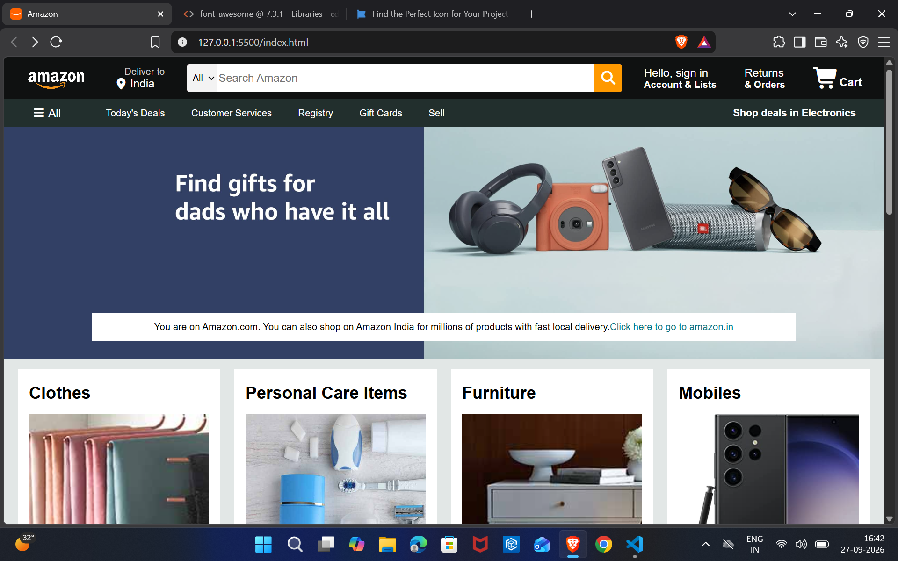
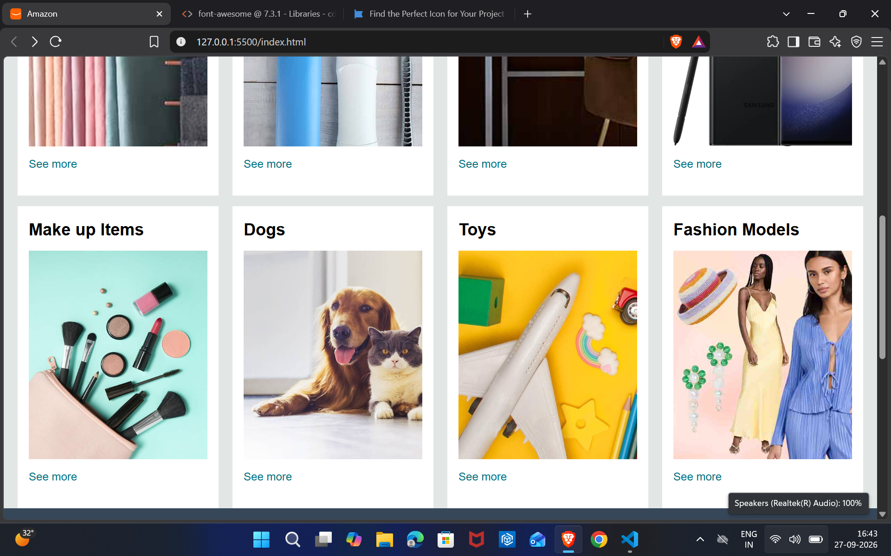
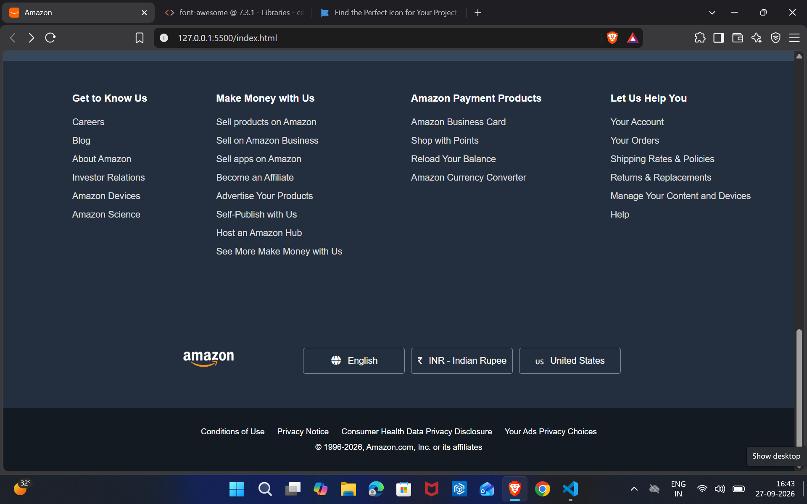

# Amazon Frontend Clone

## 📌 About the Project

This is an Amazon-inspired e-commerce frontend project built using HTML5 and CSS3. I created this project to practice frontend development and improve my understanding of webpage structure, CSS layouts, Flexbox, and UI design.

## 🛠️ Technologies Used

* HTML5
* CSS3
* Font Awesome

## ✨ Features

* Amazon-style navigation bar
* Delivery location section
* Search bar
* Account and orders section
* Shopping cart UI
* Hero section
* Product category cards
* Multi-section footer
* Flexbox layout
* Background images

## 📸 Project Preview

### Header & Navigation

### Hero & Product Sections

### Footer

## 📚 What I Learned

Through this project, I practiced:

* Structuring webpages using HTML5
* Using CSS selectors and the box model
* Creating layouts using Flexbox
* Working with background images
* Creating navigation bars and footers
* Organizing a frontend project

## 🔮 Future Improvements

* Add JavaScript functionality
* Make the search bar functional
* Add interactive buttons
* Add shopping cart functionality
* Improve responsive design
* Deploy the website using GitHub Pages

## 🔗 GitHub Repository

https://github.com/kumarbysani2007/amazon-frontend-clone
